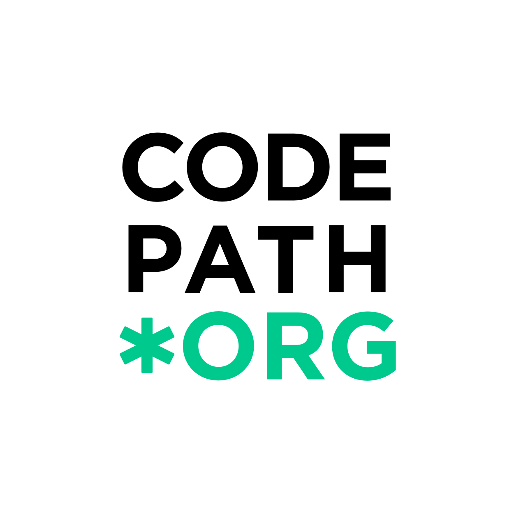
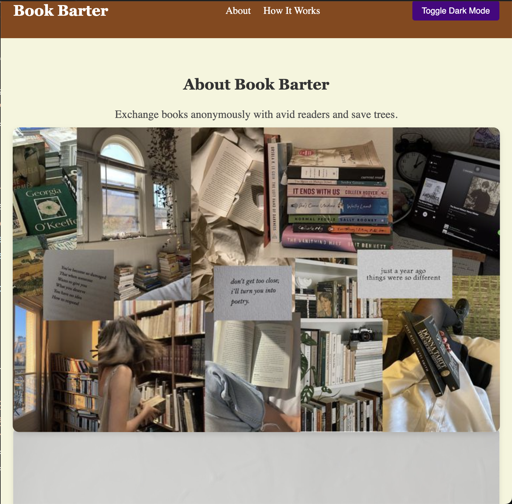
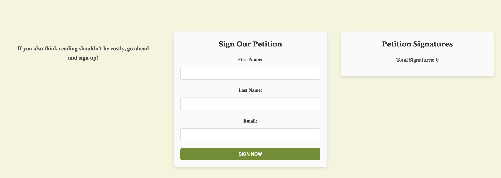

<p align="center">
  
</p>

# Book Barter System

Welcome to the **Book Barter System** web app! This project was created as part of CodePath's Web Development course. It allows users to exchange books anonymously while promoting environmental sustainability. Users can sign a petition, view information about the platform, toggle dark mode, and interact with various features that make the system fun and engaging.

## Demo

You can view a live demo of the project here:  
[Live Demo Link](https://flexible-scaling-plane-137.vscodeedu.app/)

## Features

- **Dark Mode**: Toggle between light and dark modes for a customized viewing experience.
- **Petition Form**: Users can sign a petition to promote affordable reading and environmental sustainability.
- **Interactive UI**: Smooth scrolling animations, responsive design, and visually appealing interface.
- **Video Section**: Watch an embedded YouTube video explaining why books are awesome.
- **Signature Counter**: Displays the number of petition signatures in real-time.

## Technologies Used

- **HTML5**: Markup language for the structure of the app.
- **CSS3**: Styling language for the layout, colors, typography, and animations.
- **JavaScript**: For interactive features like form validation, petition submission, and dark mode toggle.
- **Responsive Design**: The app is fully responsive, ensuring it looks great on all screen sizes.
- **IntersectionObserver API**: Used for animating sections when they come into view during scrolling.

## My Learning Journey

### Week 1: Ecosystem of Web

#### Key Concepts:
- Understanding the fundamental structure of the web.
- Introduction to web servers, browsers, and the HTTP protocol.
- Setting up local development environments using tools like VS Code, Git, and GitHub.

#### Learning Outcome:
- Got familiar with the ecosystem of web development, including the basic workflow from creating a web page to deploying it.
- Started by setting up the **Book Barter System** repository on GitHub and pushing initial code, including the basic HTML and CSS skeleton of the app.

#### Connection to Project:
- Initial setup of the **Book Barter System** project and exploration of GitHub for version control.

### Week 2: Activism Project Selection

#### Key Concepts:
- Understanding how to select a meaningful and impactful project.
- Defining the problem you are trying to solve through technology.

#### Learning Outcome:
- Chose the idea of a **Book Barter System** that helps readers exchange books and promotes environmental sustainability.
- Defined the goals of the project: creating a platform for readers to exchange books, sign a petition, and promote affordable reading.

#### Connection to Project:
- This was the foundation for the development of features like the petition form and the focus on a sustainable, community-driven platform.

### Week 3: HTML & CSS

#### Key Concepts:
- HTML tags, attributes, and the structure of web pages.
- CSS styling basics: colors, margins, padding, fonts, and text alignment.

#### Learning Outcome:
- Implemented the basic structure of the app, creating the homepage and initial sections like **About**, **How It Works**, and **Petition**.
- Styled the page with CSS to make it visually appealing and user-friendly, ensuring readability and clear navigation.

#### Connection to Project:
- Created the skeleton for the **Book Barter System** and began styling it with a focus on accessibility and a clean design.

### Week 4: Flexbox and Pseudo Selectors

#### Key Concepts:
- Flexbox layout system for creating flexible and responsive designs.
- Using pseudo-selectors like `:hover` and `:active` to add interactivity and enhance user experience.

#### Learning Outcome:
- Implemented **Flexbox** for responsive layouts, ensuring the app looked great on both desktop and mobile devices.
- Styled interactive elements like buttons using **pseudo-selectors** to make them visually appealing and user-friendly.

#### Connection to Project:
- The **Flexbox** layout was used extensively in the navigation bar, form sections, and the general layout of the **Book Barter System**, ensuring that it adapts to various screen sizes.

### Week 5: DOM & Events

#### Key Concepts:
- Manipulating the DOM (Document Object Model) with JavaScript.
- Handling user input and events (e.g., button clicks, form submissions).

#### Learning Outcome:
- Added interactivity to the page, including the **Dark Mode Toggle** and the ability to submit a petition form.
- Used event listeners in JavaScript to listen for user actions like button clicks and form submissions.

#### Connection to Project:
- The **Dark Mode Toggle** and form submission functionality were built using JavaScript, which interacts with the DOM to change page elements dynamically.

### Week 6: HTML Forms

#### Key Concepts:
- Creating forms in HTML for collecting user input (e.g., name, email, etc.).
- Structuring form elements like `input`, `button`, and `select`.

#### Learning Outcome:
- Built the **Petition Form** to collect user data (name, email) and allow them to sign the petition.
- Learned how to handle form data and prepare it for submission.

#### Connection to Project:
- The **Petition Form** is a key feature, allowing users to sign up and support the cause. This form also feeds into the petition counter.

### Week 7: Form Validation

#### Key Concepts:
- Validating form data before submission.
- Using JavaScript to check that the form fields are correctly filled out.

#### Learning Outcome:
- Implemented form validation for the **Petition Form** to ensure users provide their full name and a valid email address.
- Displayed error messages when users input invalid or incomplete data.

#### Connection to Project:
- The **Petition Form** was enhanced with JavaScript validation to improve user experience and prevent incorrect submissions.

### Week 8: JavaScript Animations

#### Key Concepts:
- Introduction to animating elements with JavaScript.
- Manipulating element properties like `opacity`, `transform`, and `position` for dynamic effects.

#### Learning Outcome:
- Implemented smooth animations for page elements using **JavaScript**.
- Created an engaging experience for users as they scroll through sections with animations.

#### Connection to Project:
- Used **JavaScript** to add animations to the petition section and other parts of the app, enhancing the overall user experience.

### Week 9: Aesthetic Animations

#### Key Concepts:
- Adding refined animations using CSS for aesthetic and visual appeal.
- Using transitions and keyframes for smoother animations.

#### Learning Outcome:
- Enhanced the visual presentation of the app by adding subtle CSS animations to buttons, forms, and images.
- Improved the overall aesthetics of the app with hover effects and transitions.

#### Connection to Project:
- **CSS animations** were used for button hover effects and smooth scrolling, making the app more visually engaging and interactive.

### Week 10: Demo Week

#### Key Concepts:
- Bringing everything together and polishing the project for presentation.
- Preparing a final demo and reflecting on the learning process.

#### Learning Outcome:
- Finished the final version of the **Book Barter System**, addressing any issues, fine-tuning the code, and preparing for deployment.
- Delivered a final demo showcasing the functionality of the app, including dark mode, petition signing, and video embedding.

#### Connection to Project:
- The final tweaks involved integrating everything smoothly, ensuring all interactive features worked well and the app was fully responsive.

## Project Idea

The idea behind this project is to provide a platform for readers to exchange books and reduce waste. The **Book Barter System** promotes a sustainable way of reading where users can share their old books in exchange for new ones. The petition section encourages users to support affordable reading initiatives while contributing to environmental causes.

## 📸 Screenshots

### Homepage


### Petition Section



## Installation

To run this project locally, follow these steps:

1. Clone the repository:
   ```bash
   git clone https://github.com/yourusername/book-barter-system.git
   ```
2. Navigate to the project folder:
   ```bash
   cd Codepath-Bookbarter
   ```
3. Open the `index.html` file in your browser.

## Contributing

Contributions are welcome! If you have any ideas for improvements or bug fixes, feel free to open an issue or submit a pull request.

## License

This project is licensed under the MIT License - see the [LICENSE.md](LICENSE.md) file for details.
